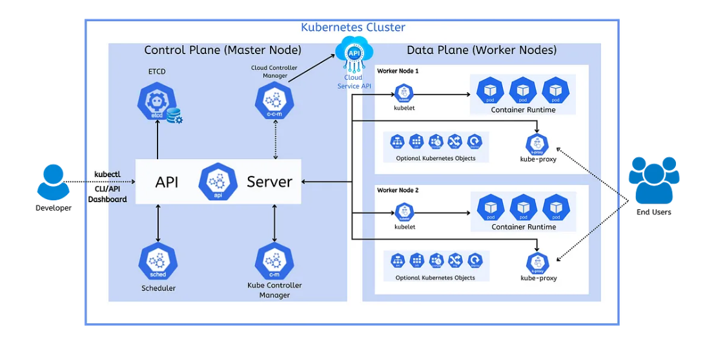

### K8S Archiechture

### control plane
  * control plane component
  ####  * 1. kube-api-server:-master node consists of kubernetes
components that control the cluster
along with the data about the cluster
state and configuration the first
component is cube api server
there should be some way for us to
interact with kubernetes cluster to use
it the api server is a component of
kubernetes control plane that exposes
the kubernetes api
we as end user can interact with these
apis directly or through cli and sdk
which again calls the same apis we can
call this api server as the front end
for the kubernetes control plane
so with this api we can instruct
kubernetes to do some operations like
scheduling pod get the list of pods etc
#### * 2. ETCD:- 
* etcd there should be some
storage where we will track all the
nodes we have in the cluster what part
or containers we have and their state
etc
etcd is a simple key value store used to
store clustered data
it is recommended to have a backup plan
for the etcd so that we can restore on
any failures
it is only accessible from the api
server for security reasons
no other component can interact directly
with etcd except api server
this etcd has a wonderful feature called
watch api
this watch waits for the changes to keys
by continuously watching and sends those
key updates back to the client
so if any change happens in the etcd
records k8s api will respond accordingly
#### * 3. kube-scheduar:-
* it helps to schedule the pords on the
various nodes based on the resource
utilization for example
if our application needs 2 gb of memory
and 2 cpu cores then the pods for that
application will be scheduled on a node
with at least those resources
factors taken into account for
scheduling decisions include hardware
and software constraints user
specifications etc
once the node is selected by the
scheduler it will call the api server.
#### Kube-control Manager
  * when a change in a service configuration
occurs for example replacing the image
from which the parts are running or
changing parameters in the configuration
yaml file the controller spots the change
and starts working towards the new
desired state
there are different controllers
available like replication controller
node controller endpoint controller etc
replication control ensures the current
number of pods are running in the
cluster
whereas node controller monitors the
health of each node and notifies the
cluster when nodes come online or
becomes unresponsive
endpoint controller connects the pods
and services to populate the endpoint
object
these controllers takes the help of the
scheduler to manage pods
these all components are needed in a
node to call a node as master node
### node components:
 * node components run on every node
 * 1. container runtime : 
   * To run a container from an image we need
     a container runtime there are many
     container runtimes available in the
     market like racket continuity docker etc
     docker is the most popular container
     runtime. container runtime is a software that is responsible for running continuous
 *  2. KUBELET: 
        
       * kubelet this
is an agent that runs on each worker
node in the cluster
it makes sure that the containers are
running in a pod
it regularly checks the new or modified
pods specification from the api server
and ensuring the pods and their
containers are healthy and running in
the desired state
the kubelet doesn't manage the
containers that are not created by
kubernetes it makes sure that containers
are running in a pod
the kubelet is also responsible for
registering a node with a kubernetes
cluster and sending events pods status
and resource utilization reports to the
master server
### kube-proxy:
  * kube proxy is a network proxy that runs
on each worker node in your cluster
implementing part of the kubernetes
service concept when a request is
received for your application it make
sure to forward your request to the
appropriate pods
the control plane is in constant contact
with your computing missions or worker
nodes to make sure your cluster is
running based on the configuration you
have provided and data plane takes care
of running your application

### * =========================================== * 
let's summarize the kubernetes
architecture with an example
let's say we want to create two
instances of an application
first we give that configuration or spec
in a document
once the spec is ready we send it to the
api server directly or through cli
the api then runs the spec by the
scheduler the scheduler selects the
worker node to which new node should be
assigned based on the configuration and
resource availability
at the same time the master server also
stores the configuration and status data
to etcd which is a key value store
once the scheduler assigns a worker node
the controller manager on the master
node then sends an object spec to the
node via kubernetes api so it can create
the desired object
upon receiving the object spec the
cubelet on the node ensures the objects
are created accordingly
whenever the status of the part is
changed like pod is killed the cubelet
via api updates the hcd on master with
the object status
this is the actual or current state of
the part
the watch functionality of etcd monitors
the changes to the desired state and
actual state
if the desired state and actual state do
not match then the control loop runs by
the controller manager responds to these
discrepancies and work towards the
actual state of the object
for example we wanted two parts for any
reason if a part goes down the current
number of parts will be one
as number of parts we wanted is not
equal to current number of parts
controller will try to make sure the
current number of parts are running will
be two
once our application is deployed when we
want to make a request to our
application
q proxy takes our request and forwards
our request to corresponding ports

