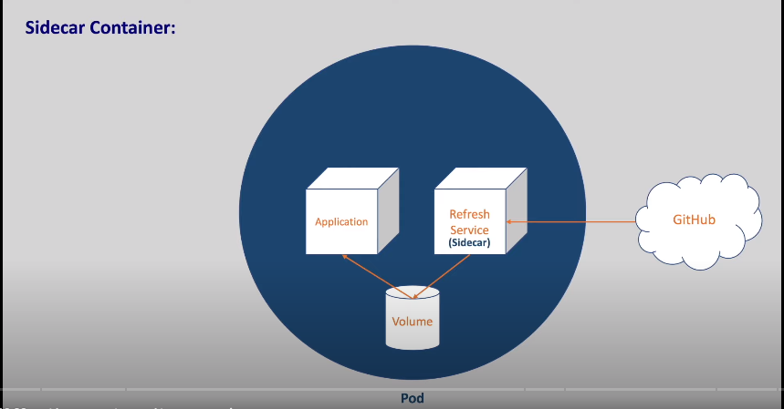

### POD:
do you know what a pod is in general
or do you know what a pea is
i'm sure you know it
the shell around the pea seeds is called
a pod
so a pod is something like a shell or
case around a group of similar things
we can compare our kubernetes pods to
this.

### ***comparison***

pea shell = pod
pea seeds = container

So the kubernetes pod is an encapsulated
layer for our containers.

* A pod can have one or more containers
so when we want to run our application
we will run it in the containers just
like we did it in docker.
* But in kubernetes the container alone
cannot be deployed and it needs to b
wrapped up in a pod .
* it might be wondering why we need this
extra layer of pod whenever application
runs in a container .
* In most cases each part will be having
only one container .
* let us see a use case where we need
multiple containers .
* let's say our application is running in
a container and it is getting
configuration from a shared volume

and we want to update the configuration
in the volume for every one hour by
pulling it from github.
* we can hand over the refresh part to
separate container without disturbing
the main container.
* This refresh service will pull the
configuration from the github for every
one hour and updates the volume
often this helping container is called a
sidecar container.
we can compare this sidecar container to
the extra carrier of the bike .

* so how do we manage these two containers
if there is no part .
if there is no part these two containers
may get deployed to different nodes
so we must make sure all related
containers go on to the same node when
we have multiple nodes in our cluster
and we need to create networks manually
to establish communication between these
containers .

 * and when we delete our main container we
need to delete the helper container
manually to save the resources
and when we create it back we should add
the helper container too
with parts everything is taken care of
all the containers in the pod will share
the same network and storage
when a part is deleted all the
containers in the pot gets deleted.

* and when the pod is created all the
containers in the pod will be created
so ***a pod is a group of one or more
containers with shade storage and
network resources***
***if we want to scale our application that
is when the load increases if we want to
increase the number of instances of our
application***
we shouldn't increase the number of
containers in the same pod
but we should increase the number of
pods.

* when pods are created each pod is
ascend a unique ip address and range of
pods.

with this we can run two applications on
the same port in the same node
in fact this is another advantage of
having pods.
* every container in a pod shares the
network space including the ip address
and network pods .
* inside a port the containers that belong
to the same pod can communicate with
each other using localhost
this is because they are in the same
network.

* containers that want to interact with
the container running in a different
pods can use ip address to communicate.

---
apiVersion: v1
kind: Pod
metadata:
  name: nginx-pod
  labels:
    app: web
spec:
  containers:
    - name: nginx-container
      image: nginx:latest
      ports:
        - containerPort: 80

* ### commands
  * create pod
      * kubectl apply -f <pod.yaml>  
  * see pods
      * kubectl get pods
  * Delete pod
      * kubectl delete pod < pod name>   
  * to see using label
      * kubectl get pods -l app=web,team=integration
  * get detailed about pod
      * kubectl get pod < pod name > -o wide   
  * convert into yaml
      * kubectl get pod < pod name > -o yaml  
  * describe a pod
      * kubectkl describe pod < podname>
  * enter into a pod
     * kubectl exec -it podname -c < container name> /bin/bash       
  * port farword   
      * kubectl port-forword < pod name > <hp:cp>
  # example
   nginx port 80 forword to 8080.

   kubectl port-forword < pod name > <8080:80>  
* logs of a pod
   * kubectl logs < pod name >
* get resourse type
   
   
   

