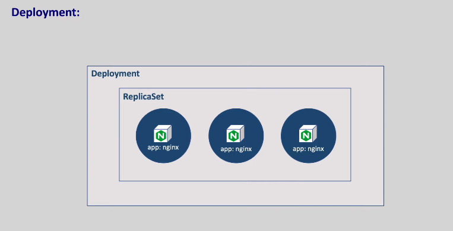

### ***Achieve self healing high availability roll out and roll back in kubernetes***
* what happens if the pods goes down
users cannot access our application
but in production we must make sure our
application is highly available
     
*  to achieve this we should create
multiple instances of our application
instead of relying on a single instance
in that case
even if one instance goes down the other
pods can still solve the request
these instances are called replicas in
kubernetes each instance is a pod.
* if we create multiple pods manually it
can be time consuming and tedious
instead of creating these replicas
manually we can automate creating these
replicas with the replicaset object in
kubernetes.
*  ### Self Healing
   * when the pods goes down
automatically bringing it back is called
self-healing. 
* when we ask replicaset to create two
replicas it make sure that two replicas
are available all the time. 
*  if any replica goes down it will create
a new replica immediately
if an extra replica is created it will
delete a new replica.

#### ===========
*  now we have multiple instances
of our application running on a node
what if this node goes down
again the same problem users cannot
access our application.
* to make our application available we
should bring all these spots onto a
healthy node
the same replica set can do that job for
us.
* 
### commands ###
  * kubectl apply -f <replica.yaml>
  * kubectl get rs
  * kubectl get po
  * kubectl delete pod < pod name>
  * kubectl delete all --all
  * kubectl get all
  * kubectl get po --show-labels
  * kubectl scale --replicas=4 deployment/< nginx-deployment>
  
  

 
### Roll out Roll Back
  *  
 *  let's say our application is running
with the 1.21 version.
 * if you want to upgrade it to 1.21.3
it requires starting the new version of
ford stopping the old version of pod
waiting and verifying the new version
has been launched successfully
also there will be the case of rolling
it back to a previous version in case of
any issues.
### Deployment
  * if we do this manually there will be lot
of chances of error and it's time
consuming we can automate this rollout
and roll back with the deployment object
in kubernetes.
  * when we create the deployment replica
set is automatically created so no need
to create the replica set manually.
  * every time we create a deployment the
deployment creates a replica set and
replicas it creates the pods
this is the reason pod is considered the
smallest unit in kubernetes.
  

  * you might be getting a question why pods
is the smallest unit why not container
because container leaves inside the pods
container alone cannot be deployed to
kubernetes container must go with the
pods so that is the reason pod is
considered the smallest unit that can be
deployed to kubernetes
  * however replicas it can be created
separately without deployment as we
discussed if we don't care about rollout
and rollback and just want our desired
number of replicas are always available.
  * 
  
  ### command
 * kubectl rollout history deployment/nginx-deployment 
  * kubectl rollout undo deployment/nginx-deployment --to-revision=1
  *  kubectl rollout status deployment/nginx-deployment .

