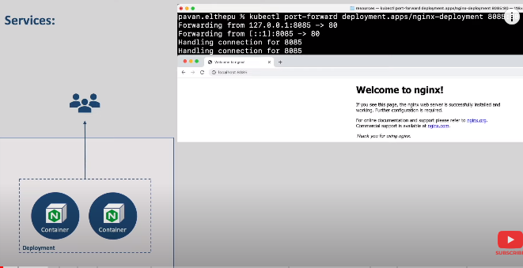
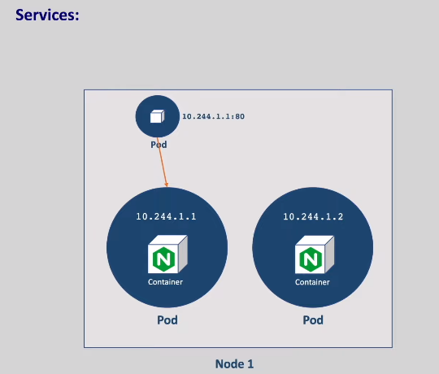
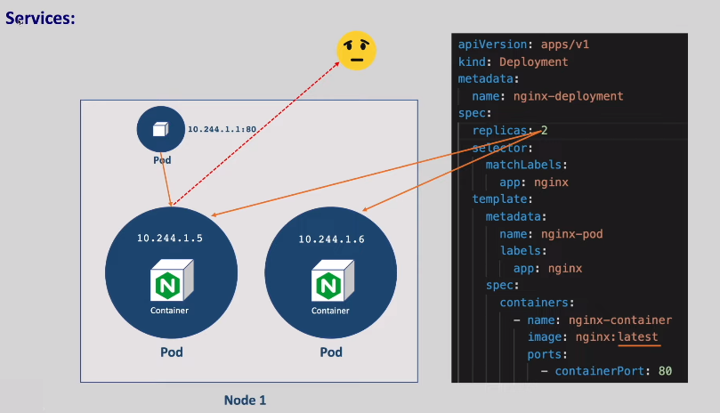
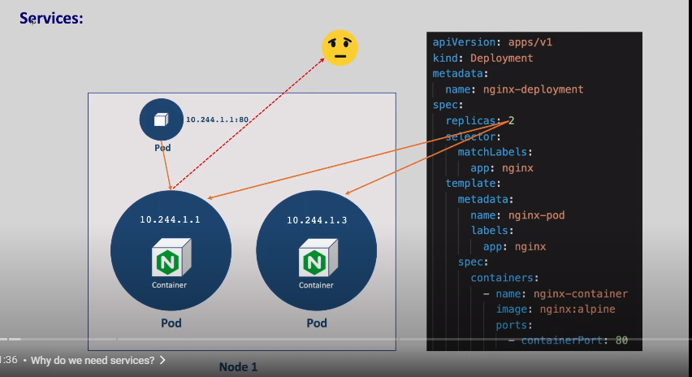
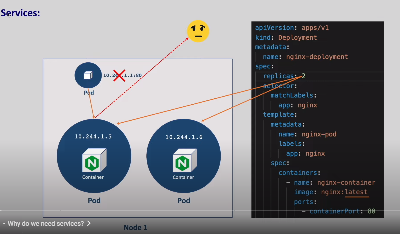
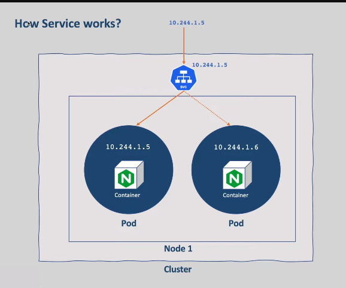
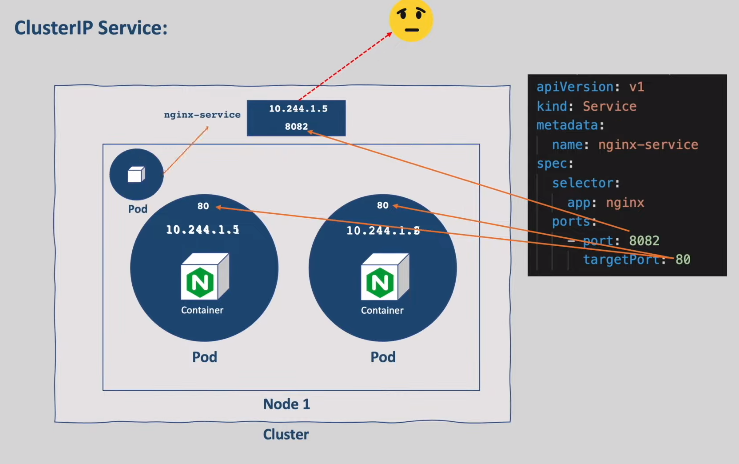
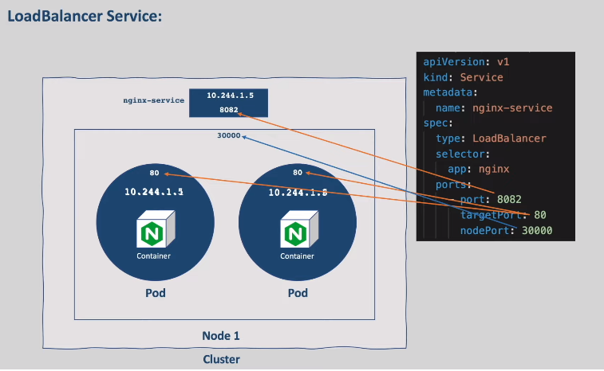
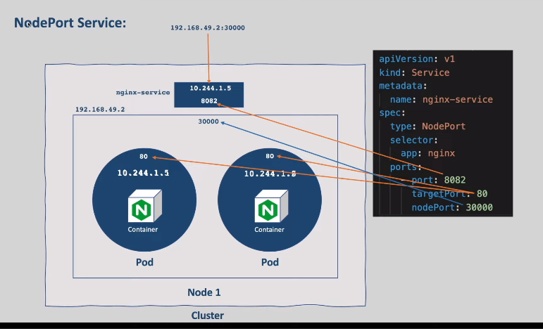
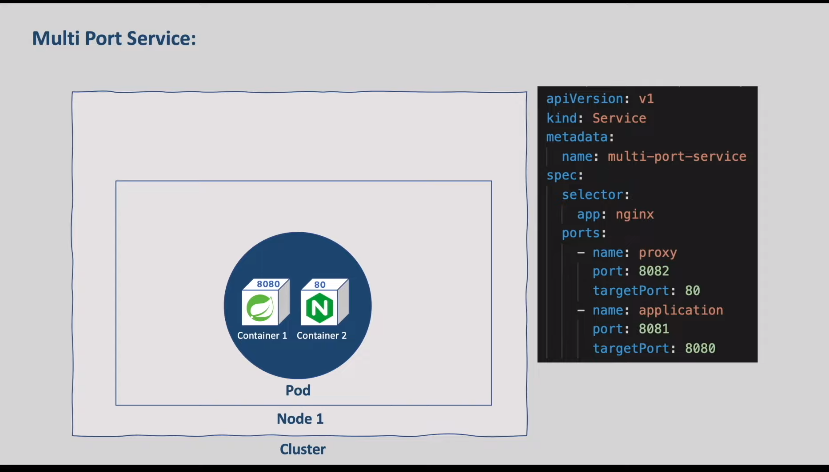

### *services in k8s*
  * so far we have deployed nginx to
kubernetes using deployments
also we could able to access deployed
nginx with port forwarding for debugging
purposes.

but how do we access it from the
production environment as an end user
that's our topic for this chapter.
  * we have our nginx up and running with
two replicas meaning two pods
and when a pod is created a new cluster
private ip addresses assigned to that
pods.

  * this is done by the kube proxy agent
running on the node as we discussed in
the kubernetes architecture section of
this series.
*  these pods are created in a separate
network and we cannot reach these pods
from outside of the cluster
only from within the cluster we can
access these pod.
* let's say we want to connect a service
running in a pod from another pods
we can connect to it with the ip address
of the pod.
* but we cannot access the same service
from outside of the cluster with the
same ip address.
even within the cluster we cannot rely
on the ip addresses of the pod
let us see why.
* as we use deployment to create these
pods these pods create and destroy
dynamically meaning if we decrease the
replica account extra pod will be
deleted and if we increase the replica
count and new pods will be created
also if you change the image version all
the pods get deleted and new pods get
created.

* and whenever the pod is recreated a new
ip address is assigned to that pod
so pods are non-permanent resources and
their ip address keeps on changing.
* and obviously when we try to access with
the old ip it fails to connect
therefore we cannot rely on their ips to
communicate if you want to access the
services running in a pod
but it's pretty common use case where we
need to access the application on the
internet or from other services
especially in microservices world
port forwarding is just for debugging
purposes to access on our local mission
it's not publicly available
that's where kubernetes services comes
into picture.

* the main objective of the services is to
abstract the pod ip address from end
user.
*  when a service is created an ip address
is assigned to that service
and this ip address doesn't change as
long as the service exists.

* so users can call a single stable ip
address instead of calling each pod
individually
and the service forward the request to
pods.
* now even if pod ip changes it doesn't
matter as the service will take care of
routing to appropriate pods.
* services are not created on any node
unlike pods.
### let us see another use case of services.
  * now we have two parts of same
application which is nginx.
  * in real time we will have many replicas
of the same application
in that case
when we make a request to which part
does our request go.
  * service will take care of load balancing
meaning service provides load balancing
when you have pod replicas it picks a
pod randomly and forwards the request to
it.
  * so we don't need to worry about load
balancing when we have multiple pods
running up the same application
services also offer other advantages
like service discovery and zero downtime
deployments.

  * ### Types of services
     * 1. ClusterIP
     * 2. NodePort
     * 3. LoadBalancer
     ## ClusterIP : 
    * cluster ip services cannot be
accessed from outside of the cluster but
those can be accessed from all the pods
in the cluster
so as the name suggests those are
restricted to cluster and this is the
port number that we given on which the
service will be receiving the request
and this is the ip address of the
service also note that we can access the
service not only with the ip address of
the service we can also access with the
name of the service.

* as you can see we still got the response
with the name of the service
so we can access the cluster ip services
with cluster ip address or with the name
of the service perfect let's come out of
the pod there might be cases where you
want to debug your cluster ip service
and you want to access from your local
mission you can do port forwarding on
services also just like we did on ports
and deployments.

### LoadBalancer : 
  
### NodePort : 
  
  
    
